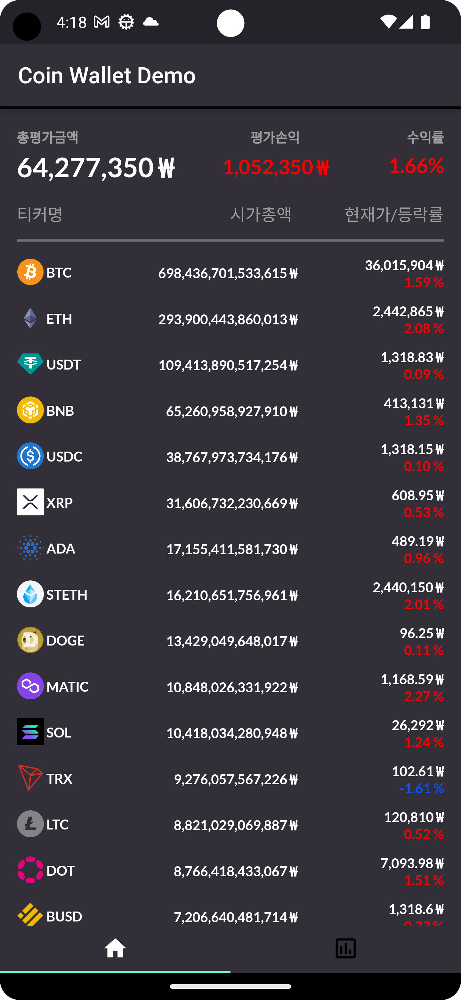
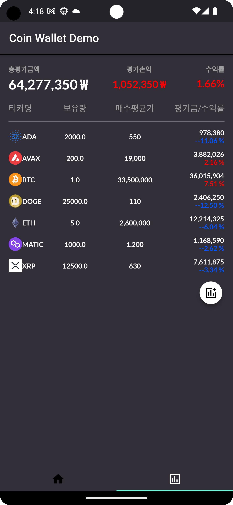
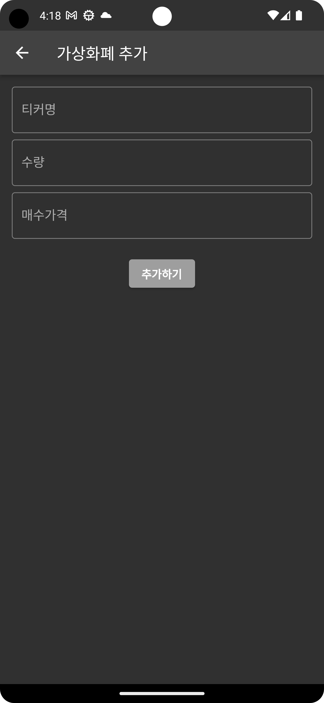

# Cryptocurrency_Tracker
Cryptocurrency Tracker App Demo in Flutter  

# Environment
Android Studio Electric Eel | 2022.1.1 Patch 1  
Flutter 2.10.0  
Dart 2.16.0  

# How to Work
CoinGecko API를 이용하여 가상화폐들의 정보를 json 형태로 받아옴 
이를 가공하여 사용자가 시가총액 순으로 가상화폐들의 현재가 및 등락률을 볼 수 있게 나열함  
LocalStorage(shared_preferences)를 이용하여 사용자가 자신의 포트폴리오를 관리할 수 있게 구현함  

