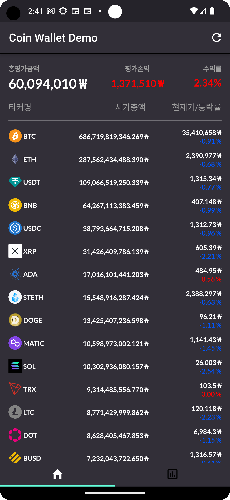
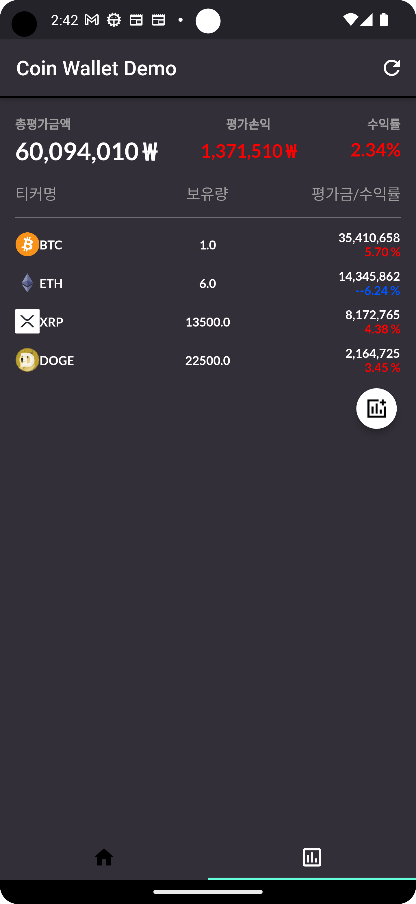

# Cryptocurrency_Tracker
Cryptocurrency Tracker App Demo in Flutter  

# Environment
Android Studio Electric Eel | 2022.1.1 Patch 1  
Flutter 2.10.0  
Dart 2.16.0  
CoinGecko API  
LocalStorage(shared_preferences)  

